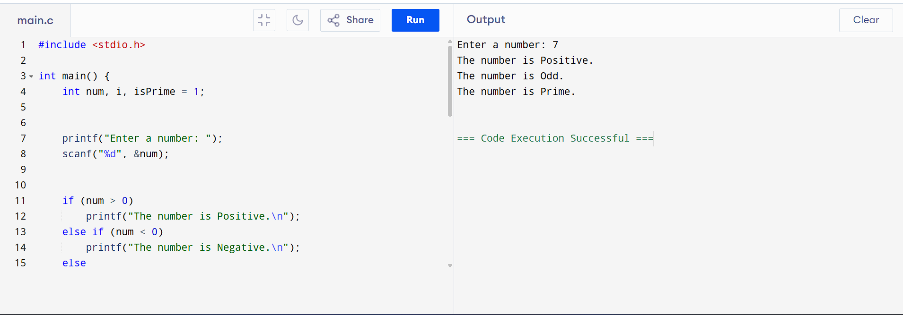

# Number Classification System using C

## Project Description
The Number Classification System is a mini project developed using the C programming language. This program takes a single integer input from the user and classifies it based on different conditions such as positive, negative, or zero. It also checks whether the number is even or odd and determines if the number is a prime number.

This project is designed to help beginners understand basic programming concepts in C.

---

## Why This Project Is Created
This project is created as part of an academic mini project to practice and demonstrate fundamental C programming concepts such as:
- Conditional statements (if-else)
- Loops (for loop)
- Operators (modulo operator)
- User input and output

It helps in building logical thinking and problem-solving skills.

---

## Utility of the Project
- Useful for beginners learning C programming
- Helps understand number classification logic
- Can be used as a base for larger mathematical applications
- Improves understanding of decision-making and looping structures

---

## Future Scope
- The program can be extended to handle multiple numbers at once
- A menu-driven version can be implemented
- Additional checks like palindrome, Armstrong number, or factorial can be added
- The project can be converted into a graphical application in future

---

## Output Screenshot
- 

---

## Language Used
- C Programming Language

---

